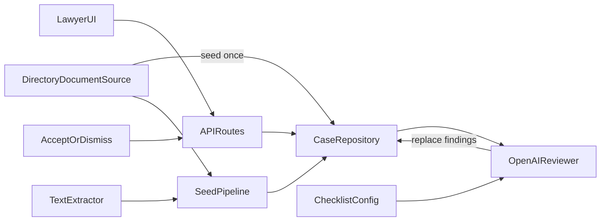

# Immigration Case Document Review MVP

## Scope

Lawyer-facing web app for **one preloaded client case** (with client name) and the **four-document checklist**. Documents ship as real `.txt` files on disk (no upload UI). OpenAI produces findings including **at least one uncertain** result in the demo submission; the lawyer accepts or dismisses each finding and sees state update immediately. No client portal, OCR, PDF, auth, or resubmission loop.

## Demo acceptance criteria

The working prototype must demonstrate:

- One client case showing the **client’s name**
- The **four-document checklist** (passport, visa application form, proof of employment, bank statement)
- A **deliberately incomplete/problematic** submission (missing + content problems)
- Findings **grouped or clearly labelled** as **missing**, **failed**, or **uncertain**
- **At least one uncertain** AI finding (not only clear pass/fail) so the lawyer can review something the system cannot confidently determine
- Enough **evidence** per finding: short explanation and/or relevant extracted text snippet
- **Accept** or **Dismiss** on each finding, with a **visible updated state** after the action (e.g. review status badge, buttons disabled/replaced, checklist/needs-attention rollup updates)
- A brief **README**: how to run, limitations, next production steps

## Explicitly not required

Authentication, multiple cases, notifications, PDF/OCR processing, upload UI, checklist editor, durable DB, or production-grade infrastructure.

## Stack

- **Next.js (App Router) + TypeScript**
- **OpenAI API** (structured JSON output for classify + validate)
- **Session-scoped in-memory storage** behind a repository interface (no DB; state lost on process restart)
- Simple CSS (e.g. CSS modules or Tailwind if scaffolding includes it) — clarity over polish

## Document source (preload abstraction)

File uploading is **not** required. Treat a small set of `.txt` files in a known directory as the client’s existing submission.

Keep that behind a **`DocumentSource`** interface so a future impl can swap directory loading for uploads or external storage without changing review/UI logic.

- `DocumentSource.loadSubmission(caseId)` → case metadata + list of document payloads (`filename`, `declaredCategory`, `bytes`/`text`)
- MVP: **`DirectoryDocumentSource`** reading [`samples/cases/demo-case/`](samples/cases/demo-case/)
- Manifest in `case.json` (or `documents.json`) maps each file to a **declared checklist category** — this is what the lawyer sees as “which file is for which requirement,” independent of AI
- Filenames reinforce the mapping (e.g. `passport.txt`, `visa_application_form.txt`, `proof_of_employment.txt`); omit bank statement so one category is clearly missing
- `TextExtractor` stays separate (plain-text now; PDF/OCR later)

## Persistence / repository

In-memory is enough for the prototype, but **application logic must not depend on the in-memory implementation directly**.

- Define a `CaseRepository` interface that owns:
  - case metadata
  - submitted documents for the case (including `declaredCategory` + extracted text)
  - AI findings and lawyer review decisions (`pending` | `accepted` | `dismissed`)
- Provide an `InMemoryCaseRepository` that preserves state for the lifetime of the running Node process
- On first access: `DocumentSource` → extract text → seed repository. Disk is seed only; live reads/writes go through the repository
- Persistence across restarts is **not** required
- Upload UI remains out of scope; a future upload `DocumentSource` (or write path into the repository) should not require redesign of review/UI

## Domain model

- **Case**: id, client name, visa type label
- **Document**: id, filename, **`declaredCategory`** (from DocumentSource manifest), extracted text
- **Checklist** (data, not scattered logic): categories `passport | visa_application_form | proof_of_employment | bank_statement`, each with criteria ids + human-readable rules from [REQUIREMENTS.md](REQUIREMENTS.md)
- **Finding**: `category`, `criterionId`, `status` (`missing` | `failed` | `uncertain` | `passed`), `message`, `evidence`, `documentId?`, `reviewStatus` (`pending` | `accepted` | `dismissed`)

Passed checks can be shown collapsed or lightly; the lawyer’s focus is missing / failed / uncertain.

## Project layout (key pieces)

- [`samples/cases/demo-case/`](samples/cases/demo-case/) — `case.json` (client + document manifest with `filename` → `declaredCategory`) + `documents/*.txt`
- [`src/lib/checklist/visa-checklist.ts`](src/lib/checklist/visa-checklist.ts) — required categories + criteria
- [`src/lib/documents/document-source.ts`](src/lib/documents/document-source.ts) — `DocumentSource` interface
- [`src/lib/documents/directory-document-source.ts`](src/lib/documents/directory-document-source.ts) — directory-backed loader
- [`src/lib/extraction/types.ts`](src/lib/extraction/types.ts) + [`plain-text-extractor.ts`](src/lib/extraction/plain-text-extractor.ts) — `TextExtractor`; `.txt` only
- [`src/lib/storage/case-repository.ts`](src/lib/storage/case-repository.ts) + [`in-memory-case-repository.ts`](src/lib/storage/in-memory-case-repository.ts)
- [`src/lib/case/seed-demo-case.ts`](src/lib/case/seed-demo-case.ts) — DocumentSource + TextExtractor → repository if empty
- [`src/lib/review/openai-reviewer.ts`](src/lib/review/openai-reviewer.ts) — evaluate criteria per declared category; emit missing for categories with no doc; use uncertain for low-confidence checks
- API routes + [`src/app/page.tsx`](src/app/page.tsx) as before

## OpenAI review flow

1. Seed repository from `DocumentSource` (directory preload); extract text via `TextExtractor`.
2. For each checklist category with no document declaring that category → `missing` findings.
3. For each submitted document, evaluate that document’s **`declaredCategory`** criteria against its text + client name.
4. Model returns per-criterion: `pass | fail | uncertain`, short explanation, optional evidence snippet from the document text.
5. Prompt/schema must allow and encourage **`uncertain`** when a criterion cannot be confidently evaluated (ambiguous dates, illegible/missing fields, weak evidence) — not only binary pass/fail.
6. Replace findings in the repository on re-run; accept/dismiss apply to the current finding set until process restart.

Require `OPENAI_API_KEY` in `.env.local`. Use structured JSON outputs for reliable parsing.

## Lawyer UI (one page)

When the page opens, documents are already loaded (no upload).

Sections:

1. **Case header** — **client name**, visa type, note that submission is preloaded `.txt` from a sample directory
2. **Required checklist** — four categories with status rollup; each category shows linked filename when a matching doc exists, or “No document submitted”
3. **Submitted documents** — each row shows **filename + declared category label** so the file↔requirement mapping is obvious
4. **Findings** — grouped or clearly labelled **Missing / Failed / Uncertain** (filters or section headers)
   - Each finding: criterion, category, short explanation, evidence snippet when available, linked filename
   - **Accept** / **Dismiss** actions
   - After action: **visible state change** (e.g. status chip Accepted/Dismissed, actions replaced, checklist and “needs attention” recount without full page confusion)
5. **Needs attention** summary — categories with pending (non-dismissed) missing/failed/uncertain findings
6. **Run AI review** / re-run with loading/error states

## Sample documents (engineered for the demo)

Under `samples/cases/demo-case/`, `case.json` includes client name (e.g. `Jordan Lee`) and a document manifest. Files:

- `passport.txt` → Passport — **failed** (e.g. expired date and/or name mismatch vs client name)
- `visa_application_form.txt` → Visa application form — **failed** (unsigned / empty required fields)
- `proof_of_employment.txt` → Proof of employment — **uncertain** by design: employer + applicant name present, but date is ambiguous or missing so “dated within last 90 days” cannot be confidently evaluated
- **No bank statement** → **missing** category

This set is intended to surface missing + failed + **at least one uncertain** finding when review is run.

## Docs / env

Update [README.md](README.md) to include:

- How to run (`npm install`, set `OPENAI_API_KEY`, `npm run dev`)
- That documents are preloaded `.txt` via `DocumentSource` (no upload); how the sample directory + manifest work
- Session-only in-memory storage (lost on restart)
- Limitations (single case, no auth, no PDF/OCR, LLM non-determinism possible)
- Next production steps (durable repository, upload/external `DocumentSource`, PDF/OCR extractor, multi-case, auth, client notifications/resubmission)

## Out of scope (explicit)

Authentication, multiple cases, notifications, upload UI, PDF/OCR, checklist editor, durable persistence across restarts, client portal/resubmission, production-grade infrastructure.
